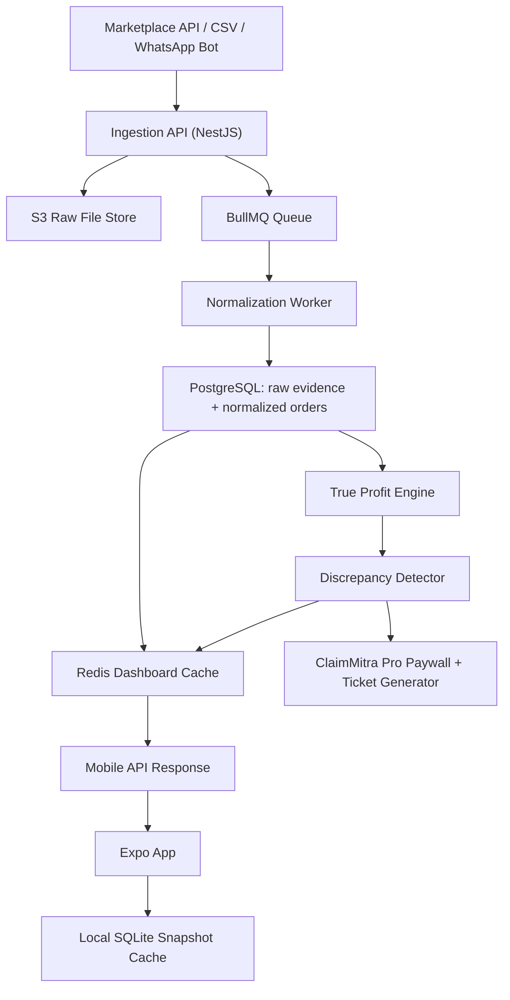

# MarginMitra Blueprint

## 2026 Expansion Note

This repository now includes an implementation-oriented expansion for Swiggy and Zomato reconciliation, Firebase phone authentication, and CSV upload plus manual review flows. The latest coding pass assumes reliable connectivity for mobile auth and ingestion, even though the earlier product blueprint still describes an offline-first long-term direction.

## 1. Product Requirements Document

### Product Thesis

MarginMitra wins by translating messy marketplace settlements into one trustworthy number: take-home cash. The free experience removes daily anxiety. The paid experience proves recoverable money and then helps the seller claim it back.

### Primary Personas

| Persona | Profile | Pain | What wins them |
| --- | --- | --- | --- |
| Rahul, reseller operator | Meesho plus Instagram seller, 100 to 300 orders per day, cash constrained | thinks in gross sales, misses fee leakage, panic around COD and returns | one-screen profit visibility, WhatsApp-friendly ingest |
| Anjali, owner-operator | Boutique seller on Amazon and ONDC, not finance-native | settlement lags, opaque penalties, no time for spreadsheets | trust, clear alerts, guided claim recovery |
| Faizan, local retailer going digital | Tier-2 store owner selling through ONDC participants and social channels | intermittent connectivity, multilingual comfort, inconsistent file formats | offline caching, Hinglish support, CSV rescue flows |

### Jobs To Be Done

- Tell me today's real profit after fees, tax impact, logistics, and returns risk.
- Tell me whether a payout is short before month-end closes.
- Let me recover money without learning platform-specific dispute processes.

### Core Features

| Feature | Free or Paid | Outcome |
| --- | --- | --- |
| OTP onboarding with marketplace selection | Free | Fast time-to-value |
| API and CSV ingestion with fuzzy header mapping | Free | Zero-setup data intake |
| True Cashflow dashboard | Free | Daily trust and habit |
| Order-level profit drilldown | Free | Explains the number |
| Missing payout and overcharge detection | Detection free, action paid | Monetization trigger |
| ClaimMitra evidence bundle and ticket generation | Paid | Direct ROI |
| Offline dashboard snapshot | Free | Works on weak networks |

### Critical User Journey

1. User signs in with WhatsApp OTP and chooses preferred language.
2. User connects Amazon, Flipkart, Meesho, ONDC participant feed, or uploads a settlement CSV.
3. Ingestion normalizes rows into a shared order model and computes fees plus reserves.
4. The first home screen shows only one hero metric: `Today's Take-Home Cash`.
5. User expands details to understand commission, logistics, GST on fees, ad spend, and RTO exposure.
6. If payout mismatch or shipping overcharge signals exist, the app surfaces a recoverable amount banner.
7. User taps the claim CTA and hits the paywall only after a quantified return is shown.

### Non-Functional Requirements

- Offline-first mobile behavior for at least the latest dashboard snapshot and recent orders.
- Background sync that tolerates intermittent connectivity and retries safely.
- Idempotent ingestion so duplicate CSV uploads do not double count orders.
- Auditability for every computed fee, source row, and claim decision.
- Paise-precision accounting with deterministic rounding rules.
- Read-heavy dashboard queries should stay sub-500ms after cache warmup.

### Edge Cases Specific To India

- Marketplace CSV headers change and may mix English with abbreviations.
- GST treatment differs across fee lines and should be visible, not implied.
- COD-heavy sellers need delayed-settlement awareness and reserve logic.
- Sellers may upload partial settlement periods or edited spreadsheets.
- WhatsApp-forwarded CSVs can have duplicate filenames and altered encodings.
- Users may open the app with no signal; the latest trusted snapshot must still render.
- Multiple channels can reuse the same external order id, so uniqueness must be scoped per connection.

### Suggested Success Metrics

- Time from signup to first dashboard under 3 minutes.
- Seven-day activation measured by three or more dashboard opens.
- Free-to-paid conversion driven by claimable amount banners.
- Average recovered claim value at least 5x monthly subscription price.
- Weekly active sellers with at least one synced marketplace above 40%.

## 2. Scalable Tech Stack (Android-First)

### Recommendation

| Layer | Choice | Why it fits MarginMitra |
| --- | --- | --- |
| Mobile app | Expo React Native with Expo Router | Fast Android-first delivery, OTA updates for JS/UI fixes, mature native escape hatches |
| On-device storage | `expo-secure-store` plus in-memory draft state | Stores app sessions safely while this branch stays online-first for auth and ingestion |
| API | NestJS on Node.js and TypeScript | Strong modularity, validation, queue integration, and shared types with mobile |
| Async work | BullMQ plus Redis | Reliable background ingestion, retries, and burst handling for CSV jobs |
| Primary database | PostgreSQL on Amazon RDS | ACID ledger behavior, relational joins for payouts and claims, JSONB for raw payload evidence |
| Object storage | Amazon S3 | Raw settlement files, evidence bundles, and claim attachments |
| Compute | ECS Fargate in `ap-south-1` | Straightforward containerized deploys without managing servers |
| Analytics or ML lane | Optional Python workers later | Useful for fuzzy column mapping or anomaly models, but not necessary for v1 core math |

### Why This Stack

- Official Expo documentation says `expo-secure-store` is suitable for sensitive client-side values such as session tokens, which is what this branch stores locally.
- Official Expo EAS Update documentation shows OTA delivery remains a strong fit for rapid copy, UI, and logic fixes without waiting for app-store review.
- Official NestJS documentation recommends BullMQ for actively developed queue support, which aligns with heavy settlement ingestion and retryable workers.
- Official AWS RDS documentation highlights Multi-AZ support and PostgreSQL availability, which is important for financial reliability.

### Important Compliance Note

I am intentionally recommending India-region hosting for latency, customer trust, and enterprise procurement comfort. That is a product and risk choice, not a blanket legal conclusion. The Digital Personal Data Protection Act, 2023 allows processing outside India except for territories the Central Government may restrict under Section 16. You should still get India counsel to validate DPDP, RBI, Account Aggregator, and sector-specific obligations before production.

### Architecture Call

Do not split into a separate Python microservice on day one unless claim heuristics outgrow the TypeScript service. A single TypeScript backend is simpler to ship, easier to hire for, and lets the shared financial model stay consistent across API and mobile.

## 3. Database Schema And Architecture Flow

### Design Principles

- Separate raw ingestion from normalized accounting records.
- Keep immutable evidence for claim generation.
- Model money as integer paise.
- Store both estimated and actual fee lines so trust can improve over time.

### Main Tables

- `app_user`
- `marketplace_connection`
- `ingestion_job`
- `uploaded_file`
- `order_record`
- `order_fee_line`
- `payout_record`
- `payout_allocation`
- `discrepancy_case`
- `dispute_claim`
- `audit_event`

Full SQL lives in [`docs/schema.sql`](./schema.sql).

### Architecture Flow

## 4. UX/UI Principles For Indian Consumers

### Trust Architecture

- Show one explicit reassurance near onboarding and sync actions: data encrypted, read-only marketplace access where possible, India-hosted infrastructure.
- Make every deduction traceable with a human label, not accounting jargon.
- Show `Last synced` time and `Source: live` or `Source: cached` on the home card.
- Explain why permissions are needed in plain Hindi or Hinglish before the OS prompt appears.

### Cognitive Load Reduction

- The home screen must prioritize one hero number, one short trend sentence, and one primary action.
- Defer complexity behind expandable cards instead of dense tables.
- Use WhatsApp-like chunking: short sections, rounded cards, plenty of whitespace, clear tick or warning states.
- Never start with a spreadsheet layout on mobile.

### Localization And Vernacular Support

- Default copy should be understandable in simple Indian English.
- Support English, Hindi, and Hinglish at minimum.
- Keep financial nouns consistent across languages; do not translate terms differently across screens.
- Localize dates, rupee formatting, and examples to Indian conventions.

### Visual Language

- Green for settled or recovered money.
- Warm orange for action needed.
- Muted slate for pending and neutral states.
- Use red only for confirmed loss, penalty, or urgent payout failure.
- Avoid fintech-dark or over-premium styling; sellers need clarity over flash.

### Accessibility

- Minimum 16px body text on Android.
- Touch targets of at least 44px.
- Icons never carry critical meaning alone; always pair them with text.

## 5. Core Feature Boilerplate Map

### What Is Included In This Starter

- shared order and payout model in [`packages/shared/src/domain.ts`](../packages/shared/src/domain.ts)
- reconciliation logic in [`packages/shared/src/calculations.ts`](../packages/shared/src/calculations.ts)
- NestJS preview endpoint in [`apps/api/src/modules/reconciliation`](../apps/api/src/modules/reconciliation)
- Expo dashboard screen in [`apps/mobile/src/components/TrueCashflowDashboard.tsx`](../apps/mobile/src/components/TrueCashflowDashboard.tsx)
- auth session persistence in [`apps/mobile/src/providers/AuthSessionProvider.tsx`](../apps/mobile/src/providers/AuthSessionProvider.tsx)
- CSV review state management in [`apps/mobile/src/providers/IngestionDraftProvider.tsx`](../apps/mobile/src/providers/IngestionDraftProvider.tsx)

### What To Build Next

- CSV parsers for Amazon, Flipkart, Meesho, and ONDC participant exports.
- A file upload endpoint plus signed S3 URLs.
- A claim evidence generator that maps discrepancy type to platform-ready ticket payloads.
- A subscription and entitlements layer around claim export actions.
- Bank payout ingestion or Account Aggregator-based reconciliation for higher-confidence mismatch detection.

## Sources Consulted

- [Expo SecureStore docs](https://docs.expo.dev/versions/latest/sdk/securestore/)
- [Expo EAS Update docs](https://docs.expo.dev/eas-update/introduction/)
- [Expo DocumentPicker docs](https://docs.expo.dev/versions/latest/sdk/document-picker/)
- [Firebase Admin verify ID tokens](https://firebase.google.com/docs/auth/admin/verify-id-tokens)
- [NestJS queues docs](https://docs.nestjs.com/techniques/queues)
- [BullMQ guide](https://docs.bullmq.io/guide/queues)
- [Amazon RDS for PostgreSQL docs](https://docs.aws.amazon.com/AmazonRDS/latest/UserGuide/CHAP_PostgreSQL.html)
- [Amazon RDS Multi-AZ docs](https://docs.aws.amazon.com/AmazonRDS/latest/UserGuide/Concepts.MultiAZSingleStandby.html)
- [Digital Personal Data Protection Act, 2023](https://www.indiacode.nic.in/bitstream/123456789/22037/1/a2023-22.pdf)
- [ONDC official site](https://ondc.org/)
